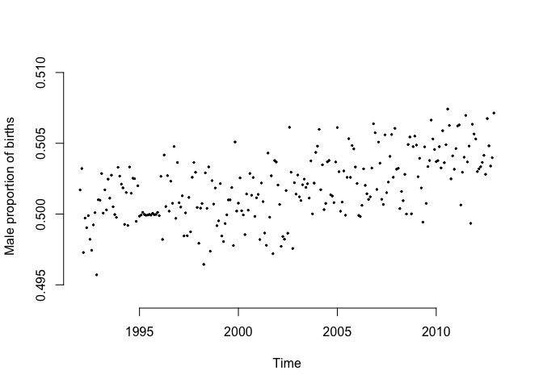
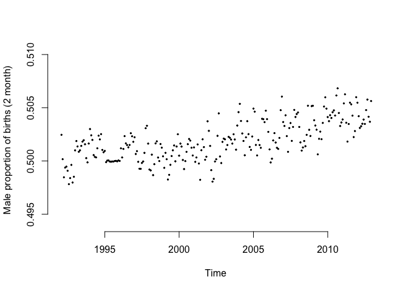
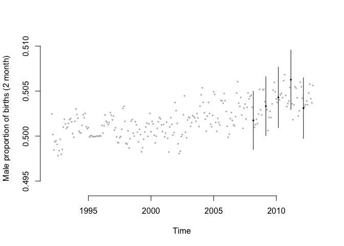
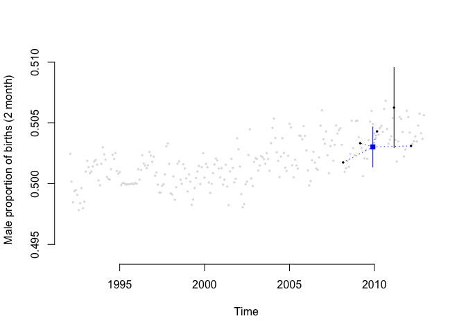
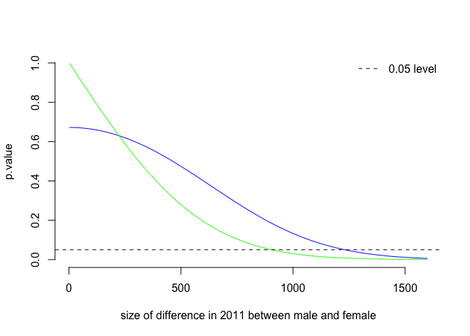
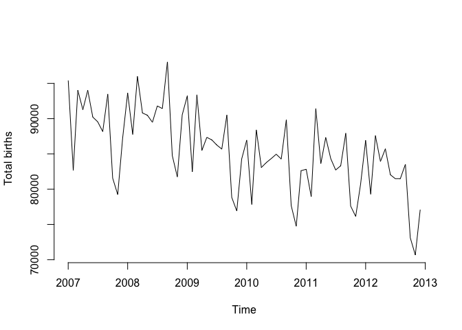
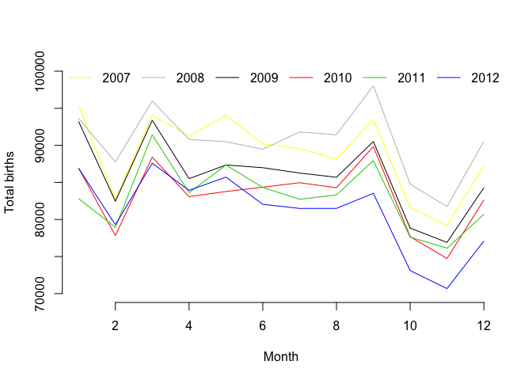
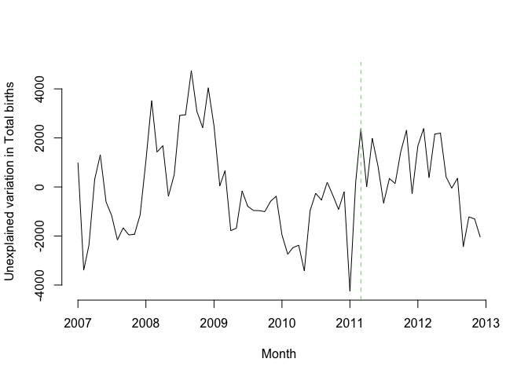
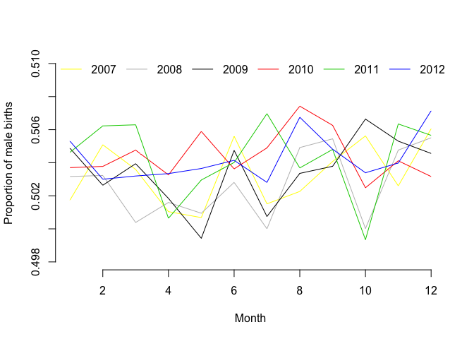
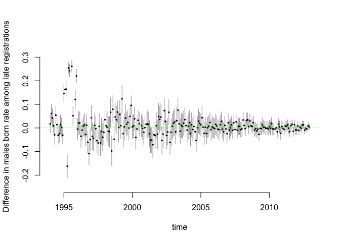

# Reanalysis
David Hood  
23 November 2015  

## Introduction

This is the "long form" supplementary analysis to the letter to the editor I have submitted discussing the article Masukume, G., & Grech, V. (2015). The sex ratio at birth in South Africa increased 9months after the 2010 FIFA World Cup. Early human development. This provides the full reproducible detail (by anyone using R) of my concerns in the analysis.

As commenting in Github can be complex for the non-technical, if you have comments and are not confident with github, you could place them at my blog page
https://thoughtfulbloke.wordpress.com/2015/11/23/for-discussion-about-analysis-on-github/

To continue on from the letter and explain each concern in detail:

## Data

The data comes from the Statistics South Africa publication: Statistics South Africa. Recorded live births. Available: http://beta2.statssa.gov.za/publications/P0305/P03052012.pdf; 2013.


```r
data2013block <- "monthstarts, Males, Females
1992-01-01,41638,41355
1992-02-01,41625,41093
1992-03-01,43488,43963
1992-04-01,41385,41432
1992-05-01,40655,40812
1992-06-01,42494,42513
1992-07-01,39559,39842
1992-08-01,40782,41202
1992-09-01,46088,46229
1992-10-01,38631,38615
1992-11-01,35945,36567
1992-12-01,40782,40617
1993-01-01,40340,40182
1993-02-01,36258,35845
1993-03-01,41799,41788
1993-04-01,39140,38873
1993-05-01,39284,39238
1993-06-01,41715,41305
1993-07-01,39312,39136
1993-08-01,41224,40773
1993-09-01,46033,45938
1993-10-01,39349,39354
1993-11-01,37948,37984
1993-12-01,42958,42394
1994-01-01,41296,40856
1994-02-01,37365,37050
1994-03-01,41078,40775
1994-04-01,41514,41635
1994-05-01,40465,40219
1994-06-01,41934,42069
1994-07-01,39501,38979
1994-08-01,41243,41001
1994-09-01,45466,45008
1994-10-01,39735,39339
1994-11-01,37330,37407
1994-12-01,42533,42195
1995-01-01,40432,40457
1995-02-01,35436,35445
1995-03-01,39571,39552
1995-04-01,38108,38112
1995-05-01,39094,39107
1995-06-01,40541,40552
1995-07-01,39094,39098
1995-08-01,39964,39976
1995-09-01,44541,44531
1995-10-01,38832,38838
1995-11-01,36365,36369
1995-12-01,40754,40734
1996-01-01,42416,42435
1996-02-01,37544,37146
1996-03-01,40977,41272
1996-04-01,39786,39127
1996-05-01,40325,40239
1996-06-01,42533,42073
1996-07-01,40110,40077
1996-08-01,41496,41112
1996-09-01,45789,45650
1996-10-01,39354,38609
1996-11-01,36556,36600
1996-12-01,42012,41404
1997-01-01,41580,41447
1997-02-01,37037,36964
1997-03-01,42405,42186
1997-04-01,39541,39786
1997-05-01,39586,39573
1997-06-01,40638,40888
1997-07-01,40292,40103
1997-08-01,40361,40564
1997-09-01,44713,44251
1997-10-01,38426,37870
1997-11-01,35833,35413
1997-12-01,40476,40400
1998-01-01,40726,41064
1998-02-01,37006,36944
1998-03-01,41703,41578
1998-04-01,38732,39287
1998-05-01,39724,39264
1998-06-01,40107,40042
1998-07-01,39050,38533
1998-08-01,39418,39834
1998-09-01,44009,43595
1998-10-01,37807,37701
1998-11-01,35164,34906
1998-12-01,39085,39213
1999-01-01,39884,39960
1999-02-01,35650,35344
1999-03-01,41123,41378
1999-04-01,40668,40985
1999-05-01,41162,41273
1999-06-01,41383,41392
1999-07-01,39768,39609
1999-08-01,40238,40077
1999-09-01,44269,43939
1999-10-01,38058,38398
1999-11-01,36937,36192
1999-12-01,40958,40924
2000-01-01,42585,42454
2000-02-01,39750,39346
2000-03-01,42717,42677
2000-04-01,40416,40426
2000-05-01,41066,41305
2000-06-01,41518,41283
2000-07-01,39988,39944
2000-08-01,40703,40239
2000-09-01,43640,43409
2000-10-01,38647,38250
2000-11-01,36351,36375
2000-12-01,39105,38926
2001-01-01,43144,42905
2001-02-01,36679,36944
2001-03-01,42234,41865
2001-04-01,40136,39995
2001-05-01,40560,40778
2001-06-01,40010,40365
2001-07-01,39476,38801
2001-08-01,39491,39526
2001-09-01,43009,42546
2001-10-01,37889,38316
2001-11-01,36260,35715
2001-12-01,39375,38800
2002-01-01,43155,42802
2002-02-01,37919,37816
2002-03-01,41051,41428
2002-04-01,39183,39432
2002-05-01,40443,40731
2002-06-01,41138,40865
2002-07-01,40609,40829
2002-08-01,40633,39649
2002-09-01,44149,43630
2002-10-01,38766,39145
2002-11-01,36248,35928
2002-12-01,39848,39624
2003-01-01,42382,41917
2003-02-01,37586,37403
2003-03-01,42889,42725
2003-04-01,40404,40071
2003-05-01,41027,40624
2003-06-01,40632,40327
2003-07-01,39480,39143
2003-08-01,39916,39736
2003-09-01,44297,43636
2003-10-01,38022,38020
2003-11-01,35356,35048
2003-12-01,39471,38789
2004-01-01,42529,41720
2004-02-01,39087,38162
2004-03-01,42628,42335
2004-04-01,41131,40562
2004-05-01,42004,41951
2004-06-01,42662,42533
2004-07-01,42968,42339
2004-08-01,44358,43691
2004-09-01,47938,47678
2004-10-01,41334,41124
2004-11-01,40037,39908
2004-12-01,43432,42797
2005-01-01,45326,44231
2005-02-01,40802,40316
2005-03-01,46284,46247
2005-04-01,44497,44346
2005-05-01,46315,45754
2005-06-01,45200,45215
2005-07-01,44134,43678
2005-08-01,44378,43442
2005-09-01,46634,46153
2005-10-01,41325,40532
2005-11-01,40844,40099
2005-12-01,45220,44622
2006-01-01,47114,46709
2006-02-01,42456,42472
2006-03-01,47284,47318
2006-04-01,45314,45203
2006-05-01,47167,46568
2006-06-01,46204,45831
2006-07-01,45358,45098
2006-08-01,45465,45277
2006-09-01,49274,49034
2006-10-01,43028,42472
2006-11-01,41042,40008
2006-12-01,44380,43372
2007-01-01,47873,47541
2007-02-01,41765,40924
2007-03-01,47349,46673
2007-04-01,45734,45544
2007-05-01,47071,46943
2007-06-01,45615,44605
2007-07-01,44916,44645
2007-08-01,44283,43884
2007-09-01,47124,46362
2007-10-01,41240,40323
2007-11-01,39824,39412
2007-12-01,44126,43070
2008-01-01,47120,46527
2008-02-01,44166,43599
2008-03-01,48028,47954
2008-04-01,45547,45257
2008-05-01,45329,45158
2008-06-01,44994,44491
2008-07-01,45901,45900
2008-08-01,46165,45266
2008-09-01,49562,48494
2008-10-01,42382,42379
2008-11-01,41259,40480
2008-12-01,45769,44772
2009-01-01,47070,46161
2009-02-01,41443,41008
2009-03-01,47061,46325
2009-04-01,42909,42594
2009-05-01,43624,43724
2009-06-01,43905,43079
2009-07-01,43196,43067
2009-08-01,43132,42557
2009-09-01,45598,44913
2009-10-01,39942,38895
2009-11-01,38861,38045
2009-12-01,42525,41756
2010-01-01,43800,43156
2010-02-01,39209,38621
2010-03-01,44627,43785
2010-04-01,41808,41266
2010-05-01,42378,41391
2010-06-01,42481,41869
2010-07-01,42894,42062
2010-08-01,42764,41513
2010-09-01,45479,44354
2010-10-01,39029,38643
2010-11-01,37676,37061
2010-12-01,41573,41050
2011-01-01,41794,41027
2011-02-01,39958,38975
2011-03-01,46291,45140
2011-04-01,41862,41755
2011-05-01,43930,43414
2011-06-01,42499,41822
2011-07-01,41937,40784
2011-08-01,41968,41354
2011-09-01,44394,43549
2011-10-01,38752,38854
2011-11-01,38549,37583
2011-12-01,40808,39895
2012-01-01,43917,42995
2012-02-01,39881,39405
2012-03-01,44073,43513
2012-04-01,42245,41684
2012-05-01,43171,42545
2012-06-01,41361,40681
2012-07-01,40974,40516
2012-08-01,41297,40197
2012-09-01,42165,41360
2012-10-01,36802,36306
2012-11-01,35617,35054
2012-12-01,39100,37999"

b13 <- read.csv(text=data2013block, colClasses = c("Date","integer","integer"))
```


## Issue 1: The cohort.

The study focused on the period 3 to 4 months after the event and 9 months after the event, as these were identified times sensitive to population level effects. The 3 to 4 month period was found not to be statistically significant, the 9 month period was (my own additional comment is that the level of significance also seems to exceed that adjusted for multiple testing, though such adjustments were not made). 


```r
#loading relevant libraries
library(lubridate)
library(knitr)
```


```r
#birthdays from World Cup period
gestation <- 268
stnddev <- 10
conception <- seq(from = as.Date("2010-06-11"), to= as.Date("2010-07-11"), by=1)

propBornWhen <- function(conceived){
  JanOrEarlier <- pnorm(as.integer(as.Date("2011-01-31") - conceived), mean=gestation, sd=stnddev, lower.tail=TRUE)
  FebOrEarlier <- pnorm(as.integer(as.Date("2011-02-28") - conceived), mean=gestation, sd=stnddev, lower.tail=TRUE)
  MarOrEarlier <- pnorm(as.integer(as.Date("2011-03-31") - conceived), mean=gestation, sd=stnddev, lower.tail=TRUE)
  AprOrEarlier <- pnorm(as.integer(as.Date("2011-04-30") - conceived), mean=gestation, sd=stnddev, lower.tail=TRUE)
  return(data.frame(conceived, preFeb = JanOrEarlier, Feb = FebOrEarlier - JanOrEarlier, Mar = MarOrEarlier - FebOrEarlier, Apr = AprOrEarlier - MarOrEarlier, postApr = 1 - AprOrEarlier))
}

birthdays <- do.call(rbind,lapply(conception, propBornWhen))
prettybirths <- birthdays
prettybirths[,2:6] <- apply(prettybirths[,2:6], 2, function(x){round(x, digits = 3)})
kable(prettybirths, format = 'markdown')
```


|conceived  | preFeb|   Feb|   Mar|   Apr| postApr|
|:----------|------:|-----:|-----:|-----:|-------:|
|2010-06-11 |      0| 0.274| 0.720| 0.006|   0.000|
|2010-06-12 |      0| 0.242| 0.750| 0.008|   0.000|
|2010-06-13 |      0| 0.212| 0.777| 0.011|   0.000|
|2010-06-14 |      0| 0.184| 0.802| 0.014|   0.000|
|2010-06-15 |      0| 0.159| 0.823| 0.018|   0.000|
|2010-06-16 |      0| 0.136| 0.842| 0.023|   0.000|
|2010-06-17 |      0| 0.115| 0.856| 0.029|   0.000|
|2010-06-18 |      0| 0.097| 0.867| 0.036|   0.000|
|2010-06-19 |      0| 0.081| 0.875| 0.045|   0.000|
|2010-06-20 |      0| 0.067| 0.878| 0.055|   0.000|
|2010-06-21 |      0| 0.055| 0.878| 0.067|   0.000|
|2010-06-22 |      0| 0.045| 0.875| 0.081|   0.000|
|2010-06-23 |      0| 0.036| 0.867| 0.097|   0.000|
|2010-06-24 |      0| 0.029| 0.856| 0.115|   0.000|
|2010-06-25 |      0| 0.023| 0.842| 0.136|   0.000|
|2010-06-26 |      0| 0.018| 0.823| 0.159|   0.000|
|2010-06-27 |      0| 0.014| 0.802| 0.184|   0.000|
|2010-06-28 |      0| 0.011| 0.777| 0.212|   0.000|
|2010-06-29 |      0| 0.008| 0.750| 0.242|   0.000|
|2010-06-30 |      0| 0.006| 0.720| 0.274|   0.000|
|2010-07-01 |      0| 0.005| 0.687| 0.308|   0.000|
|2010-07-02 |      0| 0.003| 0.652| 0.344|   0.000|
|2010-07-03 |      0| 0.003| 0.615| 0.382|   0.000|
|2010-07-04 |      0| 0.002| 0.577| 0.420|   0.001|
|2010-07-05 |      0| 0.001| 0.538| 0.459|   0.001|
|2010-07-06 |      0| 0.001| 0.499| 0.499|   0.001|
|2010-07-07 |      0| 0.001| 0.459| 0.538|   0.002|
|2010-07-08 |      0| 0.000| 0.420| 0.577|   0.003|
|2010-07-09 |      0| 0.000| 0.382| 0.614|   0.003|
|2010-07-10 |      0| 0.000| 0.344| 0.651|   0.005|
|2010-07-11 |      0| 0.000| 0.308| 0.685|   0.006|

__Table 1: The proportion of births in each month for children conceived on each day of the FIFA 2010 World Cup.__


```r
# making the assumption ovulation time is randomly distributed in the period as there is no evidence for mass simultaneous population level ovulation
overallBirths <- colMeans(birthdays[,2:6])
prettyOverall<- as.data.frame(round(overallBirths, digits = 3))
names(prettyOverall)[1] <- "overall"
kable(prettyOverall, format = 'markdown')
```


|        | overall|
|:-------|-------:|
|preFeb  |   0.000|
|Feb     |   0.059|
|Mar     |   0.705|
|Apr     |   0.235|
|postApr |   0.001|

__Table 2: The cumulative proportion of births in each month for children conceived on each day of the FIFA 2010 World Cup.__

The FIFA World Cup was from June 11 to July 11 in 2010, the authors took the February & March 2011 birth figures as 9 months after the world cup. However, taking the time from fertilisation and implantation of the embryo in the womb to delivery of 268 days with a standard deviation of 10 days (Jukic, et. al. Length of human pregnancy and contributors to its natural variation. Human Reproduction, 2013) we can calculate the expected time to birth. I also checked the South African records for evidence of any 2011 spike in the number of preterm births and could not find any such evidence not to use the 268 day figure.

For a egg fertilised on the first day of the World Cup 27.4% of children will be expected to be born in February, 72% in March, and 0.6% in April. For an egg fertilised on the last day of the World Cup 0% of children are expected to be born in February, 30.8% in March, 68.5% in April, and 0.6% in May. Overall for World Cup conceptions 5.9% of births are in February 70.5% are in March, and 23.5% are in April.


```r
#birthdays from World Cup period assuming 100% medical intervention 2 weeks after the mean gestation time
propBornWhen2 <- function(conceived){
  JanOrEarlier <- pnorm(as.integer(as.Date("2011-01-31") - conceived), mean=gestation, sd=stnddev, lower.tail=TRUE)
  FebOrEarlier <- pnorm(as.integer(as.Date("2011-02-28") - conceived), mean=gestation, sd=stnddev, lower.tail=TRUE)
  MarOrEarlier <- pnorm(as.integer(as.Date("2011-03-31") - conceived), mean=gestation, sd=stnddev, lower.tail=TRUE)
  AprOrEarlier <- pnorm(as.integer(as.Date("2011-04-30") - conceived), mean=gestation, sd=stnddev, lower.tail=TRUE)
  preFeb <- JanOrEarlier
  Feb <- FebOrEarlier - JanOrEarlier
  Mar <- MarOrEarlier - FebOrEarlier
  Apr <- AprOrEarlier - MarOrEarlier
  postApr <- 1 - AprOrEarlier
  if (month(conceived + days(282)) == 3){
    Mar <- Mar + Apr + postApr
    Apr <- 0
    postApr <- 0
  }
    if (month(conceived + days(282)) == 4){
    Apr <- Apr + postApr
    postApr <- 0
  }

  
  return(data.frame(conceived, preFeb, Feb, Mar, Apr, postApr))
}

birthsWithIntervention <- do.call(rbind,lapply(conception, propBornWhen2))
overallBirthMed <- colMeans(birthsWithIntervention[,2:6])
prettyMed <- as.data.frame(round(overallBirthMed, digits = 3))
names(prettyMed)[1] <- "overall"
kable(prettyMed, format = 'markdown')
```


|        | overall|
|:-------|-------:|
|preFeb  |   0.000|
|Feb     |   0.059|
|Mar     |   0.718|
|Apr     |   0.223|
|postApr |   0.000|

__Table 3: The cumulative proportion of births in each month for children conceived on each day of the FIFA 2010 World Cup, assuming 100% medical intervention 14 days over the mean.__ 

Even if we assume 100% of pregnancies 14 days over the mean length are completed on that day through medical intervention, the expected numbers are still February 5.9%, March 71.8%, and April 22.3%. So if an article wishes to discuss the relationship between World Cup conception and birth:


```r
m11 <- b13$Males[b13$monthstarts == as.Date("2011-03-01")]
f11 <- b13$Females[b13$monthstarts == as.Date("2011-03-01")]
mOther <- sum(b13$Males[b13$monthstarts %in% as.Date(c("2012-03-01", "2010-03-01", "2009-03-01", "2008-03-01"))])
fOther <- sum(b13$Females[b13$monthstarts %in% as.Date(c("2012-03-01", "2010-03-01", "2009-03-01", "2008-03-01"))])
forTest <- matrix(data = c(m11,f11,mOther,fOther), nrow=2)
chisq.test(forTest)$p.value
```

```
## [1] 0.07782322
```


If one month was used, it should be March, which captures at best (due to medical intervention) 71.8% of the cohort. If March alone is used the difference between monthly birth ratios calculated by the authors method (see Issue 2: Aggregation) is not statistically significant.


```r
m11a <- b13$Males[b13$monthstarts == as.Date("2011-03-01")]
f11a <- b13$Females[b13$monthstarts == as.Date("2011-03-01")]
mOthera <- sum(b13$Males[b13$monthstarts %in% as.Date(c("2012-03-01", "2010-03-01", "2009-03-01", "2008-03-01"))])
fOthera <- sum(b13$Females[b13$monthstarts %in% as.Date(c("2012-03-01", "2010-03-01", "2009-03-01", "2008-03-01"))])
m11b <- b13$Males[b13$monthstarts == as.Date("2011-04-01")]
f11b <- b13$Females[b13$monthstarts == as.Date("2011-04-01")]
mOtherb <- sum(b13$Males[b13$monthstarts %in% as.Date(c("2012-04-01", "2010-04-01", "2009-04-01", "2008-04-01"))])
fOtherb <- sum(b13$Females[b13$monthstarts %in% as.Date(c("2012-04-01", "2010-04-01", "2009-04-01", "2008-04-01"))])
m11 <- m11a + m11b
f11 <- f11a + f11b
mOther <- mOthera + mOtherb
fOther <- fOthera + fOtherb

forTest <- matrix(data = c(m11,f11,mOther,fOther), nrow=2)
chisq.test(forTest)$p.value
```

```
## [1] 0.5369228
```


If two months were used, it should be March and April, which captures at best 94.1% of the cohort. If March and April are used the difference between monthly birth ratios calculated by the authors method is not statistically significant.


```r
m11a <- b13$Males[b13$monthstarts == as.Date("2011-03-01")]
f11a <- b13$Females[b13$monthstarts == as.Date("2011-03-01")]
mOthera <- sum(b13$Males[b13$monthstarts %in% as.Date(c("2012-03-01", "2010-03-01", "2009-03-01", "2008-03-01"))])
fOthera <- sum(b13$Females[b13$monthstarts %in% as.Date(c("2012-03-01", "2010-03-01", "2009-03-01", "2008-03-01"))])
m11b <- b13$Males[b13$monthstarts == as.Date("2011-04-01")]
f11b <- b13$Females[b13$monthstarts == as.Date("2011-04-01")]
mOtherb <- sum(b13$Males[b13$monthstarts %in% as.Date(c("2012-04-01", "2010-04-01", "2009-04-01", "2008-04-01"))])
fOtherb <- sum(b13$Females[b13$monthstarts %in% as.Date(c("2012-04-01", "2010-04-01", "2009-04-01", "2008-04-01"))])
m11c <- b13$Males[b13$monthstarts == as.Date("2011-02-01")]
f11c <- b13$Females[b13$monthstarts == as.Date("2011-02-01")]
mOtherc <- sum(b13$Males[b13$monthstarts %in% as.Date(c("2012-02-01", "2010-02-01", "2009-02-01", "2008-02-01"))])
fOtherc <- sum(b13$Females[b13$monthstarts %in% as.Date(c("2012-02-01", "2010-02-01", "2009-02-01", "2008-02-01"))])
m11 <- m11a + m11b + m11c
f11 <- f11a + f11b + f11c
mOther <- mOthera + mOtherb + mOtherc
fOther <- fOthera + fOtherb + fOtherc

forTest <- matrix(data = c(m11,f11,mOther,fOther), nrow=2)
chisq.test(forTest)$p.value
```

```
## [1] 0.1696609
```

If three months were used, it should be March and April and February, which captures at best 100% of the cohort. If these three are used the difference between monthly birth ratios calculated by the authors method is not statistically significant.

If an ensemble of data was used, which compared 5.9% of births in February plus 70.5% from March plus 23.5% from April, this captures 100% of the cohort and is in proportion to the number of people born in each month. While the exact method of weighting the ensemble could be argued about, if this is used (and tested against the same months in non-world cup years) the difference between monthly birth ratios calculated by the authors method cannot be not statistically significant with such a large contribution from April compared to February.

## Issue 2: Over-estimating the significance.

The authors method takes 5 years of samples, aggregates those not in 2011 together to form a single sample of other selected years, and compares that with the 2011 data. This method destroys the variation between the samples in the non-2011 years. The comparison is, as a result, only between the proportions in 2011 and the expected proportion of the aggregate samples. Losing the between sample differences made the p-value .08 more significant than if the samples had been tested in a multiple sample way that acknowledged the variation between the samples (so the aggregation changed the p-value from 0.096 to 0.019). 

In addition, the rationale for aggregating all but the 2011 year was to remove the influence of any long term cycles in Male/ Female birth ratios. Unfortunately, this method has precisely the opposite effect- it adds an artificial appearance of significance equal to the height of 2011s point in the cycle relative to the average of the cycle. 

To make this explanation concrete, if we take the birth data...


```r
plot(b13$monthstarts,b13$Males/(b13$Males + b13$Females), pch=19, cex=0.3, frame.plot=FALSE, xlab="Time", ylab="Male proportion of births", ylim=c(0.494,0.510))
```

 

__Figure 1: Male proportion of births from the data set__

And next, aggregate each month with the preceding month...


```r
b13$Males2 <- b13$Males + c(NA,b13$Males[1:length(b13$Males)-1])
b13$Females2 <- b13$Females + c(NA,b13$Females[1:length(b13$Females)-1])
b13$msr <- b13$Males2/(b13$Males2 + b13$Females2)
plot(b13$monthstarts,b13$msr, pch=19, cex=0.3, frame.plot=FALSE, xlab="Time", ylab="Male proportion of births (2 month)", ylim=c(0.494,0.510))
```

 

__Figure 2: Aggregations of adjacent months of Male proportion of births from the data set__

If we select the February/March entries for comparison for the years 2008-2012...


```r
plot(b13$monthstarts,b13$msr, pch=19, cex=0.3, col="#BBBBBB", xlab="Time", ylab="Male proportion of births (2 month)", ylim=c(0.494,0.510), frame.plot=FALSE)
b13$year <- year(b13$monthstarts)
b13$month <- month(b13$monthstarts)
selection <- b13$year %in% 2008:2012 &b13$month == 3
t13 <- b13[selection,]
points(t13$monthstarts,t13$msr, pch=19, cex=0.3, col="black")
#2 sd confidence intervals

twoSD <- 2* ((t13$Males + t13$Females) * t13$msr * (1-t13$msr))^0.5 /(t13$Males + t13$Females)
upperbound <- t13$msr + twoSD
lowerbound <- t13$msr - twoSD
for (i in 1:nrow(t13)){
  lines(x=c(t13$monthstarts[i],t13$monthstarts[i]), y=c(upperbound[i], lowerbound[i]))
}
```

 

__Figure 3: Aggregations of adjacent months of Male proportion of births from the data set. The vertical bars are the confidence intervals of the point estimates__

If we aggregate the 4 non 2011 years by adding them together...


```r
plot(b13$monthstarts,b13$msr, pch=19, cex=0.3, col="#DDDDDDDD", xlab="Time", ylab="Male proportion of births (2 month)", ylim=c(0.494,0.510), frame.plot=FALSE)
b13$year <- year(b13$monthstarts)
b13$month <- month(b13$monthstarts)
non11<- b13$year %in% c(2008,2009,2010,2012) & b13$month == 3
t13 <- b13[selection,]
points(t13$monthstarts,t13$msr, pch=19, cex=0.3, col="black")

t13 <- b13[b13$year==2011 & b13$month == 3,]
#2 sd confidence intervals

twoSD <- 2* ((t13$Males + t13$Females) * t13$msr * (1-t13$msr))^0.5 /(t13$Males + t13$Females)
upperbound <- t13$msr + twoSD
lowerbound <- t13$msr - twoSD
lines(x=c(t13$monthstarts[1],t13$monthstarts[1]), y=c(upperbound[1], lowerbound[1]))

t13 <- b13[non11,]
mAgg <- sum(t13$Males)
fAgg <- sum(t13$Females)
nAgg <- sum(mAgg + fAgg)
msrAgg <- mAgg / (mAgg + fAgg)
twoSD <- 2* (nAgg * msrAgg * (1-msrAgg))^0.5 / nAgg
points(mean(t13$monthstarts), msrAgg, pch=15, cex=1, col="blue")

#2 sd _expected_ confidence intervals
lines(x=c(mean(t13$monthstarts),mean(t13$monthstarts)), y=c(msrAgg + twoSD, msrAgg - twoSD), col="blue", lwd=1)


for (i in 1:nrow(t13)){
  lines(x=c(mean(t13$monthstarts),t13$monthstarts[i]), y=c(msrAgg, t13$msr[i]), col="#0000FF", lty=3, lwd=1)
}
```

 

__Figure 4: Aggregations of adjacent months of Male proportion of births from the data set. The vertical bars are the confidence intervals of the point estimates. The blue square is the point estimate of treating the combined data as one sample, the reduced blue line is the confidence interval of treating the combined data as one sample__

Putting aside the question of if these 5 points represent the data until issue 3, we can see that aggregating the data to an expected value of the combined samples has lost variation- three of the five points are outside the one standard deviation expected confidence interval of the aggregate data. If we base comparisons on this, we are comparing an expected aggregate value from which the actual variation between the samples has been removed with a sample that still has the actual variation in the data present. The exact amount that this makes the differences seem more significant than they are will vary with the data set and the variation in it, but in this case we can calculate that the significance is being overestimated by 0.08 compared to a method that recognizes the variation between the samples.

“Common” advice for using Chi-Squared tests of Independence used to be “you can aggregate tiny samples to get to the minimum expected value” now it is “use a test that can handle smaller values” (in large part because the development of computing resources supports more computation intensive test). But the advice has never been “you can aggregate large categories”, though there is not normally a detailed explanation of why this is bad.

The reason is that the Chi Squared test of Independence is a comparison of the variability in your data. Aggregating your samples together potentially reduces the variability in the data, due to the Central Limit Theorem and reversion to the mean. Testing one sample against an aggregation of other samples using a test of variability means that you are comparing the variability of one sample against the reduced variability of the aggregate. This means that the statistical measure of the unusualness of the sample (and so the significance of the result) is overstated.

We can apply a statistical test that does not aggregate all the samples, like applying a Chi Squared Test of independence with 4 degrees of freedom


```r
selection <- b13$year %in% 2008:2012 &b13$month == 3
example1 <- b13[selection,c ("Males2", "Females2")]
chisq.test(example1)
```

```
## 
## 	Pearson's Chi-squared test
## 
## data:  example1
## X-squared = 7.8612, df = 4, p-value = 0.0968
```

which gives a significance p-value of 0.0968, and compare it to a chi squared test on the aggregated samples


```r
m11 <- b13$Males2[b13$monthstarts == as.Date("2011-03-01")]
f11 <- b13$Females2[b13$monthstarts == as.Date("2011-03-01")]
mOther <- sum(b13$Males2[b13$monthstarts %in% as.Date(c("2012-03-01", "2010-03-01", "2009-03-01", "2008-03-01"))])
fOther <- sum(b13$Females2[b13$monthstarts %in% as.Date(c("2012-03-01", "2010-03-01", "2009-03-01", "2008-03-01"))])
example2 <- matrix(data = c(m11,mOther,f11,fOther), nrow=2)
example2
```

```
##        [,1]   [,2]
## [1,]  86249  84115
## [2,] 348488 344210
```

```r
chisq.test(example2)
```

```
## 
## 	Pearson's Chi-squared test with Yates' continuity correction
## 
## data:  example2
## X-squared = 5.5016, df = 1, p-value = 0.019
```

Apparently significant to a p-value of less than 0.02.

So there seems to be something fundamentally wrong here. We can model the development of the wrongness by starting 2011 off with the expected values given the other four years, and shifting values from female to male to see what happens


```r
m11 <- b13$Males2[b13$monthstarts == as.Date("2011-03-01")]
f11 <- b13$Females2[b13$monthstarts == as.Date("2011-03-01")]
mOther <- sum(b13$Males2[b13$monthstarts %in% as.Date(c("2012-03-01", "2010-03-01", "2009-03-01", "2008-03-01"))])
fOther <- sum(b13$Females2[b13$monthstarts %in% as.Date(c("2012-03-01", "2010-03-01", "2009-03-01", "2008-03-01"))])
n11 <- m11 + f11
m11 <- as.integer(n11 * (mOther / (mOther + fOther)))
f11 <- n11 - m11

sigpooled <- numeric()
sigmulti <- numeric()

example1[4,1] <- m11
example1[4,2] <- f11
example2[1,1] <- m11
example2[1,2] <- f11

difference <- 1:800 * 2
for (step in difference){
  example1[4,1] <- example1[4,1] + 1
example1[4,2] <- example1[4,2] - 1
example2[1,1] <- example2[1,1] + 1
example2[1,2] <- example2[1,2] - 1
  sigpooled <- c(sigpooled, chisq.test(example2)$p.value)
  sigmulti <- c(sigmulti, chisq.test(example1)$p.value)

}
#data.frame(dif= difference, sigpooled, sigmulti) this prints out the 1500 measured differences so is commented out of the final version

plot(difference, sigmulti, col="blue", type="l", ylim=c(0,1), ylab="p.value", xlab="size of difference in 2011 between male and female", frame.plot=F)
lines(difference, sigpooled, col="green", type="l")
abline(h=0.05, lty=2)
legend("topright",legend=c("0.05 level"), col=c("black"), lty=c(2), border=F, bty="n")
```

 

__Figure 5: Comparing p-values given difference sizes of difference in the 2011 figures for mutlitple testing against the other four years with four degrees of freedom (blue) versus the p-values obtain testing against the aggregate of the other years with which has eliminated the between sample variation for the other years (green)__

Testing all the years against each other, the test is initially less confident that differences are due to chance because of the between sample variation. While the pooled value produces an erroneous values (except for the exact cross-over point), of particular concern is that using a pooled sample reports a p-value of 0.05 with a difference between Male and Female of 906 while testing against all years giving a p-value of 0.1838 at the same level of difference between Male and Female. Testing against individual years does not find a significant difference in pattern of data until the difference between Male and Female in 2011 reaches 1232 There is danger zone between these levels of difference of 326 where things are erroneously being declared significant at the 0.05 level when in fact they are not. It so happens that this data falls into this zone.

## Issue 3: Removal of data.

To quote from the article:

“Because M/F shows significant cyclic temporal trends [9], analysis was restricted from 2008 to 2012 in order to minimize the effect of these trends. In addition, in order to take into account seasonality similar periods of selected years were compared, namely February and March. “

As [9] is a 1955 article  in Italian and not on the internet (so no machine aided translation is available), and I am not fluent in Italian, I cannot be completely certain I have correctly grasped the gist of it, but from my reading I am pretty confident Gini reported long term annual variation but no short term monthly or seasonal variation. If I am correct in my reading, then to remove months and test the data by comparison to years is exactly the opposite of a strategy reflecting Gini's article. A method reflecting the article would be one that removed years and did the comparison on the basis of months.

Arguably, testing on years when years is believed to contain variation is violating the independence assumptions around comparing the data, though this could be addressed by identifying and removing the variation due to long term or seasonal factors.

Better yet would be a strategy of actually checking the data for the presence of cycles. From the earlier graph it is clear there is long term variation in the data (and that averaging other years leaving 2011 unaveraged is an ineffective strategy to deal with the variation). But it is less clear if there is seasonal or monthly variation.

Starting from something for which there is genuine seasonal variation, the total number of births over time, we can 2007 to 2012 as a graph. I am nominating 2007 as a start date since I have concerns about data quality in older periods (see bonus final section).


```r
t13 <- b13[b13$monthstarts >= as.Date("2007-01-01"),]
plot(t13$monthstarts, (t13$Males + t13$Females), type="l", xlab="Time", ylab="Total births", frame.plot=FALSE)
```

 

__Figure 6: Total number of South African births per month__

If we make it a graph of months with 1 line per year


```r
plot(t13$month, (t13$Males + t13$Females), type="n", ylim=c(70000,100000), xlab="Month", ylab="Total births", frame.plot=FALSE)
for (i in unique(t13$year)){
  lines(t13$month[t13$year == i], (t13$Males[t13$year == i]+t13$Females[t13$year == i]), col=i)
}
legend("top",legend=unique(t13$year), col=unique(t13$year), border=F, bty="n", horiz=TRUE, lty=1, lwd=1)
```

 

__Figure 7: Monthly pattern of total number of South African births. The long term decrease in the number of births is represented by the height of the annual lines. Lines from different years moving in the same direction show a monthly pattern__

This monthly variation and long term variation can be expressed as a linear regression with the variables of time (the combination of year and month) and treating month as an additional nominal category


```r
t13$tot <- t13$Males + t13$Females
t13$monthnom <- as.character(t13$month)
lmod <- lm(tot ~ monthstarts + monthnom, data = t13)
summary(lmod)
```

```
## 
## Call:
## lm(formula = tot ~ monthstarts + monthnom, data = t13)
## 
## Residuals:
##     Min      1Q  Median      3Q     Max 
## -4253.8 -1179.6  -183.6  1336.2  4743.3 
## 
## Coefficients:
##               Estimate Std. Error t value Pr(>|t|)    
## (Intercept) 162392.390   5674.585  28.617  < 2e-16 ***
## monthstarts     -5.030      0.389 -12.930  < 2e-16 ***
## monthnom10   -9530.922   1193.536  -7.985 5.79e-11 ***
## monthnom11  -11729.339   1194.670  -9.818 5.09e-14 ***
## monthnom12   -4408.119   1195.883  -3.686 0.000497 ***
## monthnom2    -8181.917   1188.852  -6.882 4.28e-09 ***
## monthnom3     2271.420   1189.015   1.910 0.060954 .  
## monthnom4    -3008.330   1189.310  -2.529 0.014115 *  
## monthnom5    -1111.944   1189.712  -0.935 0.353787    
## monthnom6    -2835.361   1190.247  -2.382 0.020454 *  
## monthnom7    -2786.141   1190.881  -2.340 0.022711 *  
## monthnom8    -3032.225   1191.657  -2.545 0.013579 *  
## monthnom9     1952.692   1192.553   1.637 0.106869    
## ---
## Signif. codes:  0 '***' 0.001 '**' 0.01 '*' 0.05 '.' 0.1 ' ' 1
## 
## Residual standard error: 2059 on 59 degrees of freedom
## Multiple R-squared:  0.8943,	Adjusted R-squared:  0.8729 
## F-statistic: 41.62 on 12 and 59 DF,  p-value: < 2.2e-16
```

From the summary long term variation and annual cyclical patterns explain 87.29% of the variation in the data. We can plot the residuals, the number of births not explained by this basic pattern.


```r
plot(t13$monthstarts, lmod$residuals, type="l", xlab="Month", ylab="Unexplained variation in Total births", frame.plot=FALSE)
abline(v=as.Date("2011-03-01"), col="green", lty=2)
```

 

__Figure 7: Unexplained variation in total births once long terms and monthly variation are removed. The green line indicates March 2011__

I would interpret the graph as showing there is nothing particular unexplained in the Feb 2011 to August 2012 period.

So number of births has monthly cycles, and not much is going on in March 2011. But the articles main focus is on the proportion of male births. If we turn the same analytical tool for detecting variation to the proportion of male births, and make the same kind of monthly graph.


```r
plot(t13$month, (t13$Males / (t13$Males + t13$Females)), type="n", xlab="Month", ylab="Proportion of male births", ylim=c(0.498, 0.510), frame.plot=FALSE)
for (i in unique(t13$year)){
  lines(t13$month[t13$year == i], (t13$Males[t13$year == i] / (t13$Males[t13$year == i] + t13$Females[t13$year == i])), col=i)
}
legend("top",legend=unique(t13$year), col=unique(t13$year), border=F, bty="n", horiz=TRUE, lty=1, lwd=1)
```

 


__Figure 8: Monthly pattern of proportion of male births. If there were any patterns, the long term pattern would be represented by the height of the annual lines, and annual seasonal factors would show the lines moving in the same direction at the same time.__


There doesn't seem to be a reliable cycle based on months in that data, if we preform the same linear regression


```r
t13$msr <- t13$Males / (t13$Males + t13$Females)
t13$monthnom <- as.character(t13$month)
lmod <- lm(msr ~ monthstarts + monthnom, data = t13)
summary(lmod)
```

```
## 
## Call:
## lm(formula = msr ~ monthstarts + monthnom, data = t13)
## 
## Residuals:
##        Min         1Q     Median         3Q        Max 
## -0.0040238 -0.0009050 -0.0002187  0.0009601  0.0038738 
## 
## Coefficients:
##               Estimate Std. Error t value Pr(>|t|)    
## (Intercept)  4.920e-01  4.779e-03 102.969   <2e-16 ***
## monthstarts  8.221e-07  3.276e-07   2.510   0.0148 *  
## monthnom10  -1.211e-03  1.005e-03  -1.205   0.2330    
## monthnom11   3.654e-04  1.006e-03   0.363   0.7178    
## monthnom12   1.170e-03  1.007e-03   1.161   0.2502    
## monthnom2    6.466e-05  1.001e-03   0.065   0.9487    
## monthnom3   -2.562e-04  1.001e-03  -0.256   0.7989    
## monthnom4   -2.023e-03  1.002e-03  -2.020   0.0479 *  
## monthnom5   -1.744e-03  1.002e-03  -1.741   0.0870 .  
## monthnom6    1.295e-04  1.002e-03   0.129   0.8976    
## monthnom7   -1.228e-03  1.003e-03  -1.225   0.2254    
## monthnom8    6.539e-04  1.003e-03   0.652   0.5172    
## monthnom9    7.619e-04  1.004e-03   0.759   0.4511    
## ---
## Signif. codes:  0 '***' 0.001 '**' 0.01 '*' 0.05 '.' 0.1 ' ' 1
## 
## Residual standard error: 0.001734 on 59 degrees of freedom
## Multiple R-squared:  0.3477,	Adjusted R-squared:  0.215 
## F-statistic: 2.621 on 12 and 59 DF,  p-value: 0.00716
```

Long term variation plus monthly nominal differences only explains 21.5% of the variation in the data. More specifically, the long term trend is up, but there is so much variation in the data compared to that trend that incorporating it into the model doesn't really do anything. This is a level that would be rejected as a useful model in most disciplines, as it is approaching purely random. The consequence of this is that there is no reason to exclude comparisons between months. The variation seems both large and irregular, further reinforcing the importance of using methods that recognise the variation between samples.

Considering the 2011 green line, March does not stand out within the year, it just happens March is a peak when the other five years are showing great variation, but it is also the case in August, where I suspect without running the numbers that 2011 would test as similarly unusual. October 2011 is unusually low, and if one was to test that removing the variation in the other years, I suspect it would test as more significant (as the removed between sample variation is even greater).

## Special bonus section on analysing historical sources

With a special interest in quantitative history, of particular interest to me is structural biases in historical sources- the degree to which the results reflect artefacts in the source data collection rather than the historical reality. For example, (many years) late reporting of births has in other historical contexts lead to a survivorship bias, of not reporting people who died many years ago in infancy. This mean that if the forces affecting that reporting, such as infant mortality, have a gender bias, then that is reflected in the final figures.

We can actually test the influence of late registrations in the data, as there has been an update to the Statistics South Africa records (From appendix G pages 32-38,  Statistics South Africa. Recorded live births. Available:  http://www.statssa.gov.za/publications/P0305/P03052014.pdf; 2015.). If we subtract the old numbers from the new numbers, we can get the number of late registrations in the past two years, and assess how different the proportion of males is to the old data. Making it clear, this is not a critique of the article, this is just taking advantage of new data.


```r
data2015block <- "monthstarts, Males, Females
1994-01-01, 41664, 41196
1994-02-01, 37723, 37327
1994-03-01, 41441, 41079
1994-04-01, 41957, 42063
1994-05-01, 40756, 40544
1994-06-01, 42354, 42408
1994-07-01, 39816, 39273
1994-08-01, 41548, 41344
1994-09-01, 45824, 45399
1994-10-01, 40070, 39652
1994-11-01, 37655, 37729
1994-12-01, 42873, 42576
1995-01-01, 40925, 40728
1995-02-01, 35971, 35716
1995-03-01, 40138, 39838
1995-04-01, 38231, 38353
1995-05-01, 40031, 39412
1995-06-01, 41377, 40841
1995-07-01, 39060, 39336
1995-08-01, 40796, 40237
1995-09-01, 44871, 44799
1995-10-01, 38802, 39091
1995-11-01, 36771, 36617
1995-12-01, 41467, 41011
1996-01-01, 42662, 42686
1996-02-01, 37767, 37349
1996-03-01, 41205, 41483
1996-04-01, 39992, 39360
1996-05-01, 40553, 40475
1996-06-01, 42808, 42337
1996-07-01, 40323, 40279
1996-08-01, 41693, 41330
1996-09-01, 46026, 45876
1996-10-01, 39555, 38860
1996-11-01, 36714, 36846
1996-12-01, 42221, 41655
1997-01-01, 41773, 41609
1997-02-01, 37182, 37131
1997-03-01, 42569, 42381
1997-04-01, 39726, 39964
1997-05-01, 39755, 39744
1997-06-01, 40810, 41103
1997-07-01, 40436, 40288
1997-08-01, 40530, 40729
1997-09-01, 44857, 44435
1997-10-01, 38578, 38029
1997-11-01, 35967, 35568
1997-12-01, 40652, 40589
1998-01-01, 40864, 41185
1998-02-01, 37135, 37068
1998-03-01, 41835, 41708
1998-04-01, 38855, 39419
1998-05-01, 39841, 39387
1998-06-01, 40252, 40153
1998-07-01, 39149, 38678
1998-08-01, 39587, 39958
1998-09-01, 44150, 43764
1998-10-01, 37970, 37836
1998-11-01, 35326, 35046
1998-12-01, 39348, 39414
1999-01-01, 40019, 40094
1999-02-01, 35805, 35466
1999-03-01, 41287, 41537
1999-04-01, 40842, 41091
1999-05-01, 41304, 41430
1999-06-01, 41546, 41552
1999-07-01, 39932, 39747
1999-08-01, 40439, 40265
1999-09-01, 44466, 44117
1999-10-01, 38267, 38609
1999-11-01, 37167, 36377
1999-12-01, 41315, 41166
2000-01-01, 42790, 42655
2000-02-01, 39954, 39541
2000-03-01, 42946, 42873
2000-04-01, 40594, 40635
2000-05-01, 41289, 41533
2000-06-01, 41793, 41523
2000-07-01, 40199, 40140
2000-08-01, 40903, 40165
2000-09-01, 43865, 43624
2000-10-01, 38862, 38464
2000-11-01, 36532, 36570
2000-12-01, 39332, 39151
2001-01-01, 43344, 43092
2001-02-01, 36829, 37085
2001-03-01, 42418, 42037
2001-04-01, 40285, 40159
2001-05-01, 40712, 40966
2001-06-01, 40162, 40554
2001-07-01, 39606, 38971
2001-08-01, 39630, 39682
2001-09-01, 43166, 42723
2001-10-01, 38046, 38469
2001-11-01, 36388, 35855
2001-12-01, 39545, 38938
2002-01-01, 43323, 42946
2002-02-01, 38088, 37956
2002-03-01, 41192, 41604
2002-04-01, 39320, 39585
2002-05-01, 40623, 40866
2002-06-01, 41327, 41033
2002-07-01, 40750, 40990
2002-08-01, 40790, 39813
2002-09-01, 44346, 43779
2002-10-01, 38916, 39339
2002-11-01, 36397, 36087
2002-12-01, 40022, 39792
2003-01-01, 42554, 42074
2003-02-01, 37752, 37552
2003-03-01, 43080, 42928
2003-04-01, 40558, 40206
2003-05-01, 41242, 40781
2003-06-01, 40809, 40491
2003-07-01, 39657, 39328
2003-08-01, 40102, 39913
2003-09-01, 44492, 43823
2003-10-01, 38212, 38195
2003-11-01, 35543, 35209
2003-12-01, 39667, 38974
2004-01-01, 42711, 41905
2004-02-01, 39261, 38327
2004-03-01, 42826, 42515
2004-04-01, 41310, 40756
2004-05-01, 42199, 42136
2004-06-01, 42868, 42744
2004-07-01, 43175, 42538
2004-08-01, 44575, 43919
2004-09-01, 48151, 47940
2004-10-01, 41546, 41334
2004-11-01, 40240, 40088
2004-12-01, 43676, 43019
2005-01-01, 45552, 44440
2005-02-01, 41020, 40497
2005-03-01, 46522, 46481
2005-04-01, 44705, 44573
2005-05-01, 46609, 46041
2005-06-01, 45442, 45481
2005-07-01, 44402, 43942
2005-08-01, 44631, 43682
2005-09-01, 46950, 46438
2005-10-01, 41570, 40779
2005-11-01, 41092, 40338
2005-12-01, 45492, 44890
2006-01-01, 47392, 46987
2006-02-01, 42724, 42724
2006-03-01, 47561, 47586
2006-04-01, 45616, 45510
2006-05-01, 47451, 46857
2006-06-01, 46540, 46146
2006-07-01, 45686, 45390
2006-08-01, 45808, 45626
2006-09-01, 49581, 49360
2006-10-01, 43358, 42784
2006-11-01, 41353, 40316
2006-12-01, 44700, 43717
2007-01-01, 48241, 47875
2007-02-01, 42099, 41263
2007-03-01, 47740, 47057
2007-04-01, 46137, 45925
2007-05-01, 47479, 47366
2007-06-01, 46063, 45006
2007-07-01, 45350, 45088
2007-08-01, 44760, 44310
2007-09-01, 47598, 46846
2007-10-01, 41680, 40742
2007-11-01, 40228, 39801
2007-12-01, 44622, 43568
2008-01-01, 47600, 47009
2008-02-01, 44681, 44043
2008-03-01, 48549, 48453
2008-04-01, 46054, 45766
2008-05-01, 45882, 45643
2008-06-01, 45606, 45017
2008-07-01, 46493, 46478
2008-08-01, 46827, 45842
2008-09-01, 50287, 49177
2008-10-01, 42952, 42935
2008-11-01, 41906, 41060
2008-12-01, 46411, 45424
2009-01-01, 47720, 46806
2009-02-01, 42027, 41616
2009-03-01, 47750, 47018
2009-04-01, 43514, 43263
2009-05-01, 44290, 44396
2009-06-01, 44604, 43771
2009-07-01, 43847, 43682
2009-08-01, 43825, 43230
2009-09-01, 46344, 45639
2009-10-01, 40595, 39536
2009-11-01, 39496, 38666
2009-12-01, 43204, 42434
2010-01-01, 44514, 43843
2010-02-01, 39847, 39251
2010-03-01, 45423, 44510
2010-04-01, 42538, 41997
2010-05-01, 43143, 42152
2010-06-01, 43299, 42692
2010-07-01, 43741, 42891
2010-08-01, 43624, 42404
2010-09-01, 46425, 45221
2010-10-01, 39855, 39446
2010-11-01, 38437, 37881
2010-12-01, 42477, 41921
2011-01-01, 42646, 41867
2011-02-01, 40760, 39778
2011-03-01, 47339, 46128
2011-04-01, 42907, 42769
2011-05-01, 45046, 44460
2011-06-01, 43566, 42875
2011-07-01, 43008, 41892
2011-08-01, 43191, 42514
2011-09-01, 45776, 44821
2011-10-01, 39907, 40080
2011-11-01, 39794, 38730
2011-12-01, 42101, 41205
2012-01-01, 45270, 44369
2012-02-01, 41228, 40690
2012-03-01, 45560, 45044
2012-04-01, 43851, 43246
2012-05-01, 44835, 44190
2012-06-01, 43109, 42320
2012-07-01, 42991, 42405
2012-08-01, 43362, 42280
2012-09-01, 44669, 43826
2012-10-01, 39116, 38633
2012-11-01, 38192, 37493
2012-12-01, 42328, 41081
2013-01-01, 44667, 43575
2013-02-01, 39877, 38771
2013-03-01, 44621, 44432
2013-04-01, 42432, 41679
2013-05-01, 42843, 42151
2013-06-01, 41928, 41076
2013-07-01, 42505, 41923
2013-08-01, 42756, 42039
2013-09-01, 44141, 43778
2013-10-01, 39072, 37835
2013-11-01, 38057, 37295
2013-12-01, 42212, 41530
2014-01-01, 43519, 42789
2014-02-01, 39542, 38877
2014-03-01, 45226, 44376
2014-04-01, 42375, 41893
2014-05-01, 43527, 42984
2014-06-01, 42170, 41296
2014-07-01, 41987, 41313
2014-08-01, 41448, 40748
2014-09-01, 44265, 43235
2014-10-01, 38286, 37463
2014-11-01, 36234, 35784
2014-12-01, 39713, 38957"

b15 <- read.csv(text=data2015block, colClasses = c("Date","integer","integer"))

both <- merge(b15, b13, by="monthstarts")
both$mlate <- both$Males.x - both$Males.y
both$flate <- both$Females.x - both$Females.y
#exclude the three with negative values as clearly there are problems with those records for it to have reduced numbers between publications
both <- both[both$mlate >=0 & both$flate >=0,]
both$nlate <- (both$mlate + both$flate)
both$msrlate <- both$mlate / (both$mlate + both$flate)
both$confintlate <- 2* (both$nlate * both$msrlate * (1 - both$msrlate ))^0.5/both$nlate
both$normalmsrlate <- both$msrlate - (both$Males.y / (both$Males.y + both$Females.y))

plot(both$monthstarts, both$normalmsrlate, type="n", ylim=c(-.25,.35), ylab="Difference in males born rate among late registrations", xlab="time", frame.plot = FALSE)
for (i in 1:nrow(both)){
  lines(x=c(both$monthstarts[i],both$monthstarts[i]), y=c(both$normalmsrlate[i] + both$confintlate[i],both$normalmsrlate[i] - both$confintlate[i]), col="#999999")
}
points(both$monthstarts, both$normalmsrlate, pch=19, cex=0.3)
abline(h=0, lwd=0.5, col="green")
```

 

__Figure 9: The graph shows the degree to which the male sex ratio is different to the 2013 publication (represented by 0), including the confidence interval of the point estimate of the late reports.__

The big point that I would make about the graph is that the further back in time the records go the more variation between late records and existing records there is, and this can be coupled with that from 2003 to 2007 late registrations of births went from being the majority of recorded births to a fairly stable minority (see Figure 1: Birth registrations by status of registration, South Africa: 1994–2014, http://www.statssa.gov.za/publications/P0305/P03052014.pdf). For this combination of increasing variation depending on the time, and the increase proportion of recorded births made from late births, my personal response is to be reluctant to trust data prior to 2007 when the late registration rate stabilised. Though, empirically, the results from this data seem fairly stable from 2005.

More than the increasing variation, I will note there seems to be something wrong with the 1995 data that should be investigated further if people were to use it for anything- there is an unusual similarity in the male sex ratio as of the 2013 data set, and unusual variation in the late entries for that period compared to the earlier.


